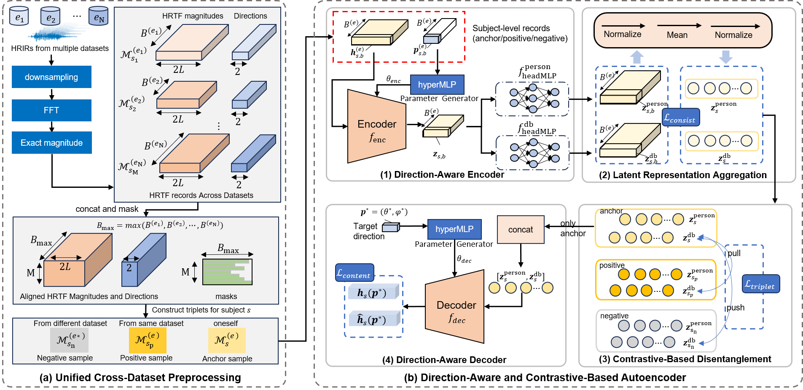

# DACD-HRTF
This repository contains the official implementation of **DACD-HRTF**.

### Overview

**DACD-HRTF** tackles **cross-dataset personalized HRTF upsampling** from sparse HRTF measurements. Instead of requiring dense measurements from hundreds or thousands of spatial directions, DACD-HRTF reconstructs high-resolution personalized HRTFs from only a small set of measured directions, while supporting joint training across HRTF datasets with heterogeneous spatial sampling grids and measurement conditions.

The key challenge is that measured HRTFs contain both **subject-specific acoustic cues** and **dataset-specific measurement variations**, such as different devices, sampling layouts, coordinate systems, and recording environments. These dataset-dependent effects can limit the generalization ability of models trained on public HRTF datasets, especially when they are deployed to a new measurement environment. DACD-HRTF addresses this issue by combining direction-aware modeling with contrastive latent disentanglement.

As shown in the overview figure, **DACD-HRTF** is organized into four main components:

1. **Unified Cross-Dataset Preprocessing**: converts HRIRs from multiple HRTF datasets into binaural HRTF magnitude records with unified spatial direction representations, enabling joint training across datasets with different sampling grids.
2. **Direction-Aware Encoder**: encodes each sparse HRTF measurement together with its corresponding spatial direction, so the model is not restricted to a fixed input layout.
3. **Contrastive-Based Disentanglement**: separates the latent representation into **subject-specific** and **dataset-specific** components, reducing the influence of dataset-dependent measurement bias.
4. **Direction-Aware Decoder**: reconstructs personalized HRTF magnitudes at arbitrary target directions conditioned on the learned latent representation and the target spatial direction.

Given a small set of **sparsely measured HRTFs**, DACD-HRTF directly reconstructs **high-resolution personalized HRTFs** at target directions without fine-tuning network parameters at inference, making it suitable for rapid deployment in unseen measurement environments.



### Requirements

We checked the code with the following computational environment.

* Ubuntu 20.04.2 LTS

* GeForce RTX 3090Ti (24GB VRAM)

* Python 3.9.10

  * ```markdown
    torch==1.13.1
    torchaudio == 0.13.1
    python-sofa == 0.2.0
    teosorboard == 2.19.0
    scipy == 1.13.1
    numpy == 1.26.4
    ```


### Datasets

You can obtain the raw HRTF datasets from the [SOFA conventions website](https://www.sofaconventions.org).

We use the following publicly available datasets in our work:

- ARI  、BiLi 、CIPIC  、Listen 、HUTUBS 、Sonicom、RIEC 、Crossmod
- **Training/in-dataset evaluation datasets**: ARI, BiLi, CIPIC, Listen, HUTUBS and Sonicom
- **Unseen-dataset evaluation datasets**:RIEC and Crossmod

> **Note**: The released pretrained checkpoint is trained on ARI, BiLi, CIPIC, Listen, HUTUBS and Sonicom.
> **Note**: Two subjects from the ARI dataset (`hrtf_nh10.sofa` and `hrtf_nh22.sofa`) are excluded due to missing measurements in certain directions.

After downloading, the raw data should be organized as follows:

```bash
data/
 ├── ARI/
 │   └── sofa/
 │       └── hrtf_nh*.sofa
 ├── BiLi/
 │   └── sofa/
 │       └── IRC_*_C_HRIR_96000.sofa
 ...
```

Run the preprocessing script located in the `preprocess/` directory:

```bash
run preprocess.py
```

### Project Structure

After dataset collection and preprocessing,  the expected directory layout of the `CDP-HRTF` project is as follows:

```
CDP-HRTF/
 ├── data/                       # Raw SOFA files (downloaded HRTF datasets)
 ├── preprocess/                 # Scripts for converting SOFA → internal format
 │   ├── preprocess.py           # Batch-processing of all SOFA files
 │   └── SOFAdatasets.py         # Dataset loader utilities for SOFA files
 ├── preprocessed_data/          # Full training/evaluation HRTF data (all subjects)
 │   └── HRIR/                   # Pickle files, one per dataset & split
 │       ├── ari_000.pkl
 │       ├── bili_000.pkl
 │       ├── cipic_000.pkl
 │       └── ... # One file per subject per dataset
 ├── preprocessed_data_few/      # Subset for quick checkpoint validation (no download needed)
 │   └── HRIR/
 │       ├── crossmod_000.pkl
 │       ├── crossmod_001.pkl
 │       ├── riec_000.pkl
 │       └── riec_001.pkl
 ├── src/                        # Core source code
 │   ├── configs.py               # Training & evaluation configurations
 │   ├── dataset.py              # Data loading & batching logic
 │   ├── losses.py               # Loss functions (LSD, ILD, contrastive, orthogonality)
 │   ├── model.py                # CDP-HRTF neural network implementation
 │   └── utils.py                # Utility functions (plotting, I/O, etc.)
 ├── t_des/                      # Precomputed t-design sampling grids
 ├── checkpoint/                 # Saved model checkpoints
 │   └── cdp_hrtf.best.net       # Pretrained model on ARI, BiLi, CIPIC, Listen, HUTUBS
 ├── train.py                    # Entry point for training
 └── evaluate_model.py           # Evaluation script for trained models
```

### Quick Start

#### Test

##### 	1. Test Pretrained Model on `preprocessed_data_few`  (no need to collect data)

```bash
python evaluate_model.py 
--dataset_directory ./preprocessed_data_few/HRIR 
--model_file ./checkpoint/cdp_hrtf.best.net 
--type_config test
```

##### 	2. Test  Pretrained Model on `preprocessed_data` (need to collect data and proprocess)

```bash
python evaluate_model.py 
--dataset_directory ./preprocessed_data/HRIR 
--model_file ./checkpoint/cdp_hrtf.best.net 
--type_config test
```

#### Train

##### 	Training the CDP-HRTF with multiple datasets (need to collect data and preprocess)

```bash
python train.py 
--dataset_directory ./preprocessed_data/HRIR 
-n ari bili cipic hutubs listen sonicom 
--type_config train
```

- The log is written in outputs/model/logs

- You can see loss graphs in tensorboard by 

  ```bash
  tensorboard --logdir=outputs/model/logs --port=6008
  ```
## Notes

- DACD-HRTF is designed for sparse-measurement HRTF upsampling and supports target-direction reconstruction without inference-time fine-tuning.
- The training datasets are **ARI, BiLi, CIPIC, HUTUBS, Listen, and Sonicom**. **RIEC** and **Crossmod** are held out for unseen-dataset evaluation.
- The core training code will be made public after the work is received.
  
